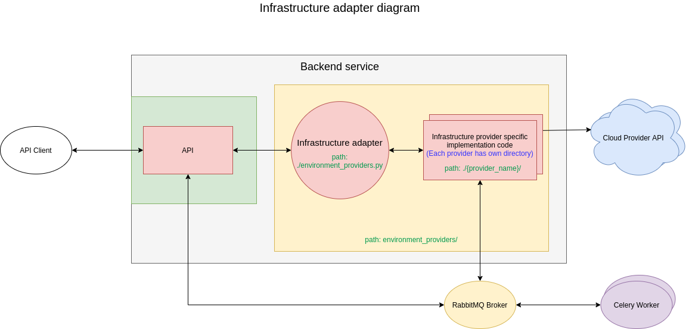

# Infrastructure adapter

PlugNPlay Infra adapter allows adding and removing cloud providers from the backend. Each provider has its own directory where are all the implementation details for the provider. Functions from the sample directory need to be implemented, to allow the proxy to use it. There is a file called environment_providers.py which is used as a proxy that accesses the providers.

## Adding cloud provider

1. Use sample directory to create the provider directory.
2. Implement the functions in provider.py file that cloud provider integration will need (if VPN is managed by Terraform, some of the function do not need to be implemented).
3. Add vpn configs in terraform/vpn/ directory.
4. Update supported_providers, get_vpn_tf_code and get_vpn_configs variables in environment_providers.py file.

## Structure

environment_providers/environment_providers.py - used as a proxy to access providers
environment_providers/{provider}.py - containing functions used by proxy
environment_providers/{provider} - directory containing provider specific files
environment_providers/{provider}/playbooks - directory containing  provider specific ansible playbooks
environment_providers/{provider}/constants.py - constants for the provider
environment_providers/{provider}/api_client.py - api client for the provider
environment_providers/{provider}/terraform/config.tf - provider terraform configuration file

## Diagram

## List of supported provider:
-   AWS
-   Azure
-   GCP
-   OnPremise
-   IotArm
-   OpenStack

## Infrastructure adapter

### Functions

-   get_vpn_tf_code
    >   **Returns Terraform code for vpn creation**

    -   Args:
        -   filtered_environment_providers (list): Environments used to create cluster

    -   Returns:
        -   string: Terraform code

-   get_vpn_configs
    >   **Returns vpn configurations for providers**

    -   Args:
        -   cluster (dict): Cluster from db

    -   Returns:
        -   dict: vpn configurations for providers

-   add_new_machines_to_resources
    >   **Add new machines to resources dict**

    -   Args:
        -   machines (dict): payload with new machines
        -   resources (dict): Cluster tfconfig from database

    -   Returns:
        -   dict: updated tfconfig with included new machines

-   create_new_machines
    >   **Create new machines for existing cluster**

    -   Args:
        -   resources (dict): Cluster tfconfig from database
        -   user_id (int): User id
        -   cluster_id (class 'uuid.UUID'): Cluster id
        -   machines (dict): New machines from request payload
        -   new_indices_counter (int): New machines start index
        -   old_machines (QuerySet): Old machines db records

    -   Raises:
        -   e: Exception

-   create_resources
    >   **Create infrastructure resources, add ssh keys and create vpn**

    -   Args:
        -   resources (dict): Cluster tfconfig
        -   user_id (int): User id
        -   cluster_id (class 'uuid.UUID'): Cluster id
        -   internal_dns_zone (string): Cluster internal dns zone

    -   Raises:
        -   e: Exception

-   add_input_validation_schemas
    >   **Add input validation schemas for environment providers**

    -   Args:
        -   schema (dict): Validation schema
        -   payload (dict): Request payload data

    -   Returns:
        -   dict: Validation schema with validations for providers

-   check_if_at_least_one_provider_is_selected
    >   **Checks if given resources contains at least one supported provider**

    -   Args:
        -   resources (dict): Providers

    -   Returns:
        -   bool: Returns true if at least one supported provider is in the dict, else returns false

-   check_if_provider_is_supported
    >   **Checks if the given provider is supported**

    -   Args:
        -   provider (string): Provider name

    -   Returns:
        -   bool: Returns true if provider is in supported providers, else returns false

-   validate_regions_zones_instance_types
    >   **Validate regions, zones and instance types from the payload**

    -   Args:
        -   payload (dict): Request payload data
        -   user (class 'django.contrib.auth.models.User'): User record from db

-   get_providers_tfconfig_params
    >   **Return cluster tfconfig paramaters for database record**

    -   Args:
        -   payload (dict): Request payload data
        -   user (class 'django.contrib.auth.models.User'): User record from db

    -   Returns:
        -   dict: Cluster tfconfig paramaters for database record

-   get_selected_providers
    >   **Returns a list of selected supported providers**

    -   Args:
        -   payload (dict): Request payload data

    -   Returns:
        -   list: List of selected supported providers

-   restart_machine
    >   **Restart cluster machine**

    -   Args:
        -   machine (class 'cloudcluster.models.Machine'): Machine record from db
        -   tfconfig (dict): Cluster tfconfig
        -   machine_provider (string): Machine provider name
        -   user_id (int): User id

    -   Raises:
        -   AttributeError: Unsupported provider

-   start_machine
    >   **Start cluster machine**

    -   Args:
        -   machine (class 'cloudcluster.models.Machine'): Machine record from db
        -   tfconfig (dict): Cluster tfconfig
        -   machine_provider (string): Machine provider name
        -   user_id (int): User id

    -   Raises:
        -   AttributeError: Unsupported provider

-   stop_machine
    >   **Stop a cluster machine**

    -   Args:
        -   machine (class 'cloudcluster.models.Machine'): Machine record from db
        -   tfconfig (dict): Cluster tfconfig
        -   machine_provider (string): Machine provider name
        -   user_id (int): User id

    -   Raises:
        -   AttributeError: Unsupported provider

-   restart_all_machines
    >   **Restart all cluster machines**

    -   Args:
        -   cluster_id (class 'uuid.UUID'): Cluster id
        -   user_id (int): User id

-   stop_all_machines
    >   **Stop all cluster machines**

    -   Args:
        -   cluster_id (class 'uuid.UUID'): Cluster id
        -   user_id (int): User id

-   start_all_machines
    >   **Start all cluster machines**

    -   Args:
        -   cluster_id (class 'uuid.UUID'): Cluster id
        -   user_id (int): User id

-   get_nodes
    >   **Get all cluster nodes**

    -   Args:
        -   cluster_id (class 'uuid.UUID'): Cluster id
        -   user_id (int): User id

    -   Returns:
        -   dict: All cluster nodes

-   get_machine_records
    >   **Returns list of machines for db records**

    -   Args:
        -   resources (dict): Cluster tfconfig
        -   clouds (dict): Dictionary containing each cloud nodes info (returned from get_nodes function)
        -   cluster_id (class 'uuid.UUID'): Cluster id
        -   new_indices_counter (int, optional): New machines start index. Defaults to 0.
        -   old_machine_counter (int, optional): Number of old machines. Defaults to 0.

    -   Returns:
        -   list: List of machines for db records

-   get_provider_machine_records
    >   **Returns list of machines for db for specified provider**

    -   Args:
        -   resources (dict): Cluster tfconfig
        -   clouds (dict): Dictionary containing each cloud nodes info (returned from get_nodes function)
        -   cluster_id (class 'uuid.UUID'): Cluster id
        -   provider (string): Provider name
        -   new_indices_counter (int, optional): New machines start index. Defaults to 0.
        -   old_machine_counter (int, optional): Number of old machines. Defaults to 0.

    -   Returns:
        -   list: List of machines for db for specified provider

-   get_used_terraform_environment_resources
    >   **Create graph with used terraform resources**

    -   Args:
        -   resources (dict): Cluster tfconfig from database
        -   user_id (int): User id
        -   cluster_id (class 'uuid.UUID'): Cluster id

-   get_valid_operating_systems
    >   **Returns a list of valid operating systems for selected provider**

    -   Args:
        -   payload (dict): Request payload data
        -   request (dict): User Request

    -   Returns:
        -   list: List of valid operating systems for selected provider

-   validate_account_permissions
    >   **Validate account cloud permissions**

    -   Args:
        -   resources (dict): Cluster tfconfig from database
        -   user_id (int): User id

    -   Returns:
        -   none, dict, : None or dict with error

-   update_providers_regions
    >   **Async update all providers regions**

    -   Args:
        -   resources (dict): Cluster tfconfig from database
        -   user_id (int): User id

-   update_provider_regions
    >   **Async update selected provider regions**

    -   Args:
        -   provider (string): Provider name
        -   user_id (int): User id
        -   account_id (int): Cloud account id

-   check_region_parameters
    >   **Check if selected providers region and zone parameters are valid**

    -   Args:
        -   resources (dict): Cluster tfconfig from database
        -   user_id (int): User id

    -   Returns:
        -   dict: Dictionary with the result of the check

-   plan_terraform_resources
    >   **Create graph with resources that will be created with Terraform, returns the path to graph files**

    -   Args:
        -   resources (dict): Cluster tfconfig from database
        -   user_id (int): User id

    -   Returns:
        -   string: Path to graph files

-   count_provider_machines
    >   **Used when adding new machines, returns the number of old machines**

    -   Args:
        -   machines (dict): New machines dict that have the name of the provider and new nodes counter
        -   resources (dict): Cluster tfconfig from database

    -   Returns:
        -   int: Number of old machines

-   count_nodes
    >   **Count the number of nodes in the tfconfig**

    -   Args:
        -   resources (dict): Cluster tfconfig from database

    -   Returns:
        -   int: Number nodes

-   get_service_selected_providers
    >   **Get the selected providers for a service**

    -   Args:
        -   service_options (dict): Service options
        -   configuration ([type]): Service kubernetes configuration

    -   Returns:
        -   list: List of selected providers
        -   string: String of selected providers

-   get_dc_node
    >   **Get the DC node public IP**

    -   Args:
        -   tfconfig (dict): Cluster tfconfig
        -   cluster (class 'cloudcluster.models.Clusters): Cluster from db

    -   Returns:
        -   string: DC node public IP

-   get_dc_node_from_nodes_ips
    >   **Get DC node private IP from nodes_ips variable (check get_nodes_ips function)**

    -   Args:
        -   nodes_ips (dict): From get_nodes_ips function
        -   resources (dict): Cluster tfconfig from database

    -   Returns:
        -   string: DC node private IP

-   get_dc_node_name_and_private_ip
    >   **Get DC node name and private IP from cluster tfconfig**

    -   Args:
        -   resources (dict): Cluster tfconfig from database
        -   old_machines (QuerySet): QuerySet with nodes
        -   clouds (dict): Dictionary containing each cloud nodes info (returned from get_nodes function) 

    -   Returns:
        -   string: DC node private IP
        -   string: DC node hostname

-   get_nodes_ips
    >   **Returns nodes private IPs**

    -   Args:
        -   clouds ([type]): [description]

    -   Returns:
        -   dict: Dictionary containing first node private ip and a list of all nodes private ips for all clouds
        -   list: List of all nodes private ips for all clouds

-   fix_hostnames
    >   **Run fix hostname function for each cloud provider in the cluster**

    -   Args:
        -   user_id (int): User id
        -   nodes_ips (dict): From get_nodes_ips function
        -   gateway_address (string): Address of the gateway node
        -   cluster_id (class 'uuid.UUID'): Cluster id

-   fix_added_machines_hostnames
    >   **Fix hostnames on new cluster machines**

    -   Args:
        -   machines (dict): New machines from request payload
        -   user_id (int): User id
        -   new_nodes (list): Array of new nodes addresses
        -   cluster_id (class 'uuid.UUID'): Cluster id
        -   gateway_address (string): Address of the gateway node
        -   new_indices_counter (int): New machines start index

-   get_gateway_address_dc_private_ip_and_client_hosts
    >   **Returns gateway address, dc private ip and list of nodes private ips**

    -   Args:
        -   clouds (dict): Dictionary containing each cloud nodes info (returned from get_nodes function) 
        -   cluster_id (class 'uuid.UUID'): Cluster id
        -   user_id (int): User id

    -   Returns:
        -   string: Gateway node public address
        -   string: DC node private ip
        -   list: List of all nodes private ips

-   destroy_resources
    >   **Destroy cluster created resources**

    -   Args:
        -   cluster_id (class 'uuid.UUID'): Cluster id
        -   user_id (int): User id
        -   internal_dns_zone (string): Cluster internal dns zone

-   get_account_labels
    >   **Returns cloud accounts that have associated cluster**

    -   Args:
        -   request (dict): User Request

    -   Returns:
        -   list: Cloud accounts that have associated cluster

-   validate_credentials
    >   **Async task. Validate credentials against the cloud provider. Checks if the credentials are valid, and if the user have needed access to the provider.**

    -   Args:
        -   payload (dict): Request payload data
        -   request (dict): User Request

    -   Raises:
        -   Exception: Unsupported provider

    -   Returns:
        -   class 'celery.app.task': Celery task

-   update_cloud_credentials
    >   **Updates cloud provider account credentials**

    -   Args:
        -   payload (dict): Request payload data
        -   request (dict): User Request

    -   Raises:
        -   Exception: Unsupported provider

-   create_cloud_credentials
    >   **Create cloud provider account credentials**

    -   Args:
        -   payload (dict): Request payload data
        -   request (dict): User Request
        -   all_account_labels (list): All used account labels

    -   Raises:
        -   Exception: Unsupported provider

-   get_provider_accounts
    >   **Get user cloud provider accounts**

    -   Args:
        -   payload (dict): Request payload data
        -   request (dict): User Request

    -   Returns:
        -   list: List of user cloud provider accounts

-   get_valid_regions
    >   **Returns a list of regions that are valid for the account**

    -   Args:
        -   payload (dict): Request payload data
        -   request (dict): User Request

    -   Raises:
        -   Exception: Account does not exist

    -   Returns:
        -   list: List of regions that are valid for the account

-   get_valid_zones
    >   **Returns a list of zones that are valid for the account**

    -   Args:
        -   payload (dict): Request payload data
        -   request (dict): User Request

    -   Raises:
        -   Exception: Account does not exist

    -   Returns:
        -   list: List of zones that are valid for the account

-   get_valid_instances
    >   **Returns a list of instance types that are valid for the account**

    -   Args:
        -   payload (dict): Request payload data
        -   request (dict): User Request

    -   Raises:
        -   Exception: Account does not exist

    -   Returns:
        -   list: List of instance types that are valid for the account

-   get_cluster_machines
    >   **Get the list of machines in a cluster**

    -   Args:
        -   cluster (class 'cloudcluster.models.Clusters): Cluster from db
        -   request (dict): User Request
        -   payload (dict): Request payload data
        -   tfconfig (dict): Cluster tfconfig

    -   Raises:
        -   Exception: Can\'t find any of the cluster\'s machines.

    -   Returns:
        -   list: List of machines in a cluster

-   get_providers_networks
    >   **Extracts the network requested by each provider**

    -   Args:
        -   payload (dict): Request payload data

    -   Returns:
        -   list: List of networks

-   check_provided_credentials
    >   **Checks if credentials for each cloud provider are provided**

    -   Args:
        -   request (dict): User Request

    -   Returns:
        -   dict: Dictionary that contains information for each provider if the credentials for that provider are added

-   get_dns_servers_ips
    >   **Returns a dictionary containing all dns servers ips**

    -   Args:
        -   nodes_ips (dict): From get_nodes_ips function

    -   Returns:
        -   dict: Dictionary containing all dns servers ips

-   nodes_labels
    >   **Add label to each kubernetes node provider={provider name}**

    -   Args:
        -   resources (dict): Cluster tfconfig
        -   user_id (int): User id
        -   clouds (dict): Dictionary containing each cloud nodes info (returned from get_nodes function) 
        -   master_ip (string): DC private IP
        -   gateway_address (string): Address of the gateway node
        -   cluster_id (class 'uuid.UUID'): Cluster id

-   get_vpn_provider_networks
    >   **Get the vpn providers networks**

    -   Args:
        -   resources (dict): Cluster tfconfig
        -   skip_network_providers (list)): List of providers to skip

    -   Returns:
        -   list: List of networks

-   kubernetes_storage_integration
    >   **Add cloud native storage integrations on kubernetes cluster**

    -   Args:
        -   resources (dict): Cluster tfconfig
        -   user_id (int): User id
        -   clouds (dict): Dictionary containing each cloud nodeinfo (returned from get_nodes function) 
        -   master_ip (string): DC private IP
        -   gateway_address (string): Address of the gateway node
        -   cluster_id (class 'uuid.UUID'): Cluster id

-   kubernetes_loadbalancer_integration
    >   **Add kubernetes loadbalancer intergration for selected cloud provider**

    -   Args:
        -   resources (dict): Cluster tfconfig
        -   user_id (int): User id
        -   clouds (dict): Dictionary containing each cloud nodes info (returned from get_nodes function) 
        -   master_ip (string): DC private IP
        -   gateway_address (string): Address of the gateway node
        -   cluster_id (class 'uuid.UUID'): Cluster id

-   remove_nodeselector_from_ccm
    >   **Remove nodeselector from the cloud controller manager kubernetes cluster (used when adding new machines)**

    -   Args:
        -   resources (dict): Cluster tfconfig
        -   user_id (int): User id
        -   master_node_private_ip (string): Master kubernetes node private ip
        -   gateway_address (string): Address of the gateway node
        -   cluster_id (class 'uuid.UUID'): Cluster id

-   add_nodeselector_to_ccm
    >   **Add a nodeselector to the cluster**

    -   Args:
        -   resources (dict): Cluster tfconfig
        -   user_id (int): User id
        -   master_node_private_ip (string): Master kubernetes node private ip
        -   gateway_address (string): Address of the gateway node
        -   cluster_id (class 'uuid.UUID'): Cluster id

-   get_master_nodes
    >   **Get master nodes pubic and private IPs**

    -   Args:
        -   nodes_ips (dict): From get_nodes_ips function
        -   clouds (dict): Dictionary containing each cloud nodes info (returned from get_nodes function) 

    -   Returns:
        -   list: List of public IPs
        -   list: List of private IPs

-   get_storageclass_name
    >   **Returns the kubernetes storageclass name**

    -   Args:
        -   resources (dict): Cluster tfconfig

    -   Returns:
        -   string: Kubernetes storageclass name

-   set_vpn_configs
    >   **Returns vpn configurations**

    -   Args:
        -   filtered_environment_providers (list): Environments used to create cluster
        -   vpn_configs (dict): vpn configurations
        -   resources (dict): Cluster tfconfig
        -   cluster_id (class 'uuid.UUID'): Cluster id
        -   user_id (int): User id
        -   vpn_provider_name (string): VPN provider name

    -   Returns:
        -   dict: VPN configurations

-   get_dns_configs
    >   **Returns DNS configs for selected providers**

    -   Args:
        -   resources (dict): Cluster tfconfig
        -   nodes_ips (dict): From get_nodes_ips function
        -   dns_servers_ips ([type]): Response 
        -   cluster_id (class 'uuid.UUID'): Cluster id

    -   Returns:
        -   [type]: [description]

-   run_dns
    >   **Installs and configures dns server each provider. Also configures all nodes to use the servers**

    -   Args:
        -   resources (dict): Cluster tfconfig
        -   nodes_ips (dict): From get_nodes_ips function
        -   dns_servers_ips (DICT): Dictionary containing all dns servers ips (returned from get_dns_servers_ips function)
        -   cluster_id (class 'uuid.UUID'): Cluster id
        -   user_id (int): User id
        -   gateway_address (string): Address of the gateway node

-   get_ansible_dns_servers
    >   **Returns DNS configurations for selected provider**

    -   Args:
        -   current_provider (string): The provider for which the returned dns configuration is created
        -   resources (dict): Cluster tfconfig
        -   providers_dns_configs (dict): All providers dns configurations (returned from get_dns_configs function)

    -   Returns:
        -   string: DNS configurations for selected provider

## Implementation

### Functions

-   destroy_resources
    >   **Returns Terraform variables for cluster deletion**

    -   Args:
        - resources ([object]): [Config parameters used for cluster creation]
        - user_id ([int]): [User ID]
        - cluster_id ([string]): [Cluster ID]
        - internal_dns_zone ([string]): [Internal DNS zone]
        - nodes_counter ([type]): [Nodes counter]

    -   Raises:
        -   Exception: [Exception]

    -   Returns: tf_variables[string]: [Terraform variables]
            nodes

-   destroy_disk_resources
    >   **Destroy disk resources that are not managed by Terraform**

    -   Args:

        -   resources ([object]): [Config parameters used for cluster creation]

        -   user_id ([int]): [User ID]

-   create_new_machines
    >   **Create Terraform variables for the new machines**

    -   Args:

        -   resources ([object]): [Config parameters used for cluster creation]

        -   user_id ([int]): [User ID]

        -   cluster_id ([string]): [Cluster ID]

        -   machines ([object]): [Request body data]
        -   new_indices_counter ([type]): [Counter for new machines]
        -   old_machines ([type]): [Counter for old machines]

    -   Returns:
        -   [object]: [Terraform variables]

-   create_resources
    >   **Returns Terraform variables for cluster creation**

    -   Args:

        -   resources ([object]): [Config parameters used for cluster creation]

        -   user_id ([int]): [User ID]

        -   cluster_id ([string]): [Cluster ID]

        -   internal_dns_zone ([string]): [Internal DNS zone]
        -   nodes_counter ([type]): [Nodes counter]

    -   Returns:
        -   [tf_variables]: [Terraform variables]
        -   [nodes_counter]: [Counts cluster nodes]

-   validate_regions_zones_instance_types
    >   **Validates that all zones instance types are valid for regions.**

    -   Args:

        -   provider_data ([string]): [Provider payload data]
        -   user ([int]): [User ID]

-   get_provider_tfconfig_params
    >   **Get Terraform Configuration params from the request.**

    -   Args:

        -   payload ([string]): [Request body data]
        -   user ([int]): [User ID]

    -   Returns:
        -   [type]: [description]

-   restart_machine
    >   **Restart a machine**

    -   Args:

        -   tfconfig ([object]): [Cluster configuration]

        -   user_id ([int]): [User ID]

        -   machine ([int]): [Machine ID]

-   start_machine
    >   **Start a machine**

    -   Args:

        -   cluster_id ([string]): [Cluster ID]

        -   user_id ([int]): [User ID]

        -   machine ([int]): [Machine ID]

-   stop_machine
    >   **Stop a machine**

    -   Args:

        -   cluster_id ([string]): [Cluster ID]

        -   user_id ([int]): [User ID]

        -   machine ([int]): [Machine ID]

-   start_all_machines
    >   **Start all running machines on a cluster**

    -   Args:

        -   user_id ([int]): [User ID]

        -   cluster_id ([string]): [Cluster ID]

-   restart_all_machines
    >   **Restart all machines in a cluster**

    -   Args:

        -   user_id ([int]): [User ID]

        -   cluster_id ([string]): [Cluster ID]

-   stop_all_machines
    >   **Stop all running machines on a cluster**

    -   Args:

        -   user_id ([int]): [User ID]

        -   cluster_id ([string]): [Cluster ID]

-   get_nodes
    >   **Get all nodes from a cluster**

    -   Args:

        -   cluster_id ([string]): [Cluster ID]

        -   user_id ([int]): [User ID]

    -   Returns:
        -   [object]: [Nodes]

-   get_machine_records
    >   **Create machine records for DB**

    -   Args:

        -   resources ([object]): [Config parameters used for cluster creation]

        -   environment_provider ([string]): [Environment provider name]
        -   cloud ([array]): [Array of nodes]

        -   cluster_id ([string]): [Cluster ID]

        -   nodes_counter ([int]): [Nodes counter]
        old_machine_counter (int, optional): [Old machines counter]. Defaults to 0.

    -   Returns:
        -   [type]: [description]

-   get_used_terraform_environment_resources
    >   **Returns Terraform variables**

    -   Args:

        -   resources ([object]): [Config parameters used for cluster creation]

        -   user_id ([int]): [User ID]

        -   nodes_counter ([type]): [description]

    -   Returns:
        -   [type]: [description]

-   get_tf_code
    >   **Get Terraform code for the environment**

    -   Returns:
        -   [string]: [Terraform code]

-   get_valid_operating_systems
    >   **Get a list of valid operating systems**

    -   Args:

        -   payload ([type]): [Request body]
        -   request ([type]): [Request data]

    -   Returns:
        -   [array]: [List of available operating systems]

-   validate_account_permissions
    >   **Validate cloud account permissions**

    -   Args:

        -   resources ([object]): [cloud credentials]

        -   user_id ([int]): [User ID]

    -   Returns:
        -   [object]: [None or Error]

-   update_provider_regions
    >   **Update region parameters for cloud account**

    -   Args:

        account_id ([int]): [Account ID]

        -   user_id ([int]): [User ID]

-   check_region_parameters
    >   **Check if selected regions are valid**

    -   Args:

        -   resources ([object]): [Config parameters used for cluster creation]

        -   user_id ([int]): [User ID]

    -   Returns:
        -   [object]: ['provider': 'bool']

-   plan_terraform_resources
    >   **Returns Terraform variables for cluster plan**

    -   Args:

        -   resources ([object]): [Config parameters used for cluster creation]

        -   user_id ([int]): [User ID]

        -   internal_dns_zone ([string]): [Internal DNS zone]
        -   nodes_counter ([type]): [Nodes counter]

    -   Returns:
        -   nodes_counter [type]: [Nodes counter]
        -   tf_variables[string]: [Terraform variables]

-   validate_credentials
    >   **Validate user cloud account credentials**

    -   Args:

        -   payload ([object]): [Request body]
        -   request ([object]): [Request data]

    -   Raises:
        -   Exception: [Exception]

    -   Returns:
        -   [string]: [Async task]

-   update_cloud_credentials
    >   **Update user cloud account credentials**

    -   Args:

        -   payload ([object]): [Request body]
        -   request ([object]): [Request data]

-   create_cloud_credentials
    >   **Create Cloud Account credentials for a given user**

    -   Args:

        -   payload ([object]): [Request body]
        -   request ([object]): [Request data]

        -   all_account_labels ([array]): [All used account labels]

-   get_gateway_address_dc_private_ip_and_client_hosts
    >   **Helper function to get the gateway IP and client hosts**

    -   Args:

        -   clouds ([string]): [Cloud nodes from get_nodes function]
        -   master_private_ip ([string]): [Master node private ip]
        -   gateway_address ([string]): [Public address of the gateway node]
        -   client_hosts ([array]): [Client hosts list]
        -   tfconfig ([object]): [Config parameters used for cluster creation]

        -   user_id ([int]): [User ID]

    -   Returns:
        -   master_private_ip [string]: [Master node private ip]
        -   gateway_address [string]: [Public address of the gateway node]
        -   client_hosts [string]: [Client hosts list]

-   run_nodes_labels
    >   **Add on each kubernetes node label "provider: {provider}" and "providerID: {provider_id}"**

    -   Args:

        -   resources ([object]): [Config parameters used for cluster creation]

        -   user_id ([int]): [User ID]

        -   clouds ([string]): [Cloud nodes from get_nodes function]
        -   master_ip ([string]): [Master IP private address]
        -   gateway_address ([string]): [Public address of the gateway node]

        -   cluster_id ([string]): [Cluster ID]

-   kubernetes_storage_integration
    >   **Adds a kubernetes storage integration**

    -   Args:

        -   resources ([object]): [Config parameters used for cluster creation]

        -   user_id ([int]): [User ID]

        -   clouds ([string]): [Cloud nodes from get_nodes function]
        -   master_ip ([string]): [Master IP private address]
        -   gateway_address ([string]): [Public address of the gateway node]

        -   cluster_id ([string]): [Cluster ID]

    -   Raises:
        -   Exception: [Exception]

-   kubernetes_loadbalancer_integration
    >   **Adds a kubernetes load balancer integration**

    -   Args:

        -   resources ([object]): [Config parameters used for cluster creation]

        -   user_id ([int]): [User ID]

        -   clouds ([string]): [Cloud nodes from get_nodes function]
        -   master_ip ([string]): [Master IP private address]
        -   gateway_address ([string]): [Public address of the gateway node]

        -   cluster_id ([string]): [Cluster ID]

    -   Raises:
        -   Exception: [Exception]

-   remove_nodeselector_from_ccm
    >   **Remove a nodeselector from cloud controller manager**

    -   Args:

        -   resources ([object]): [Config parameters used for cluster creation]

        -   user_id ([int]): [User ID]

        -   master_node_private_ip ([type]): [One of the master nodes private IP]
        -   gateway_address ([string]): [Public address of the gateway node]

        -   cluster_id ([string]): [Cluster ID]

-   add_nodeselector_to_ccm
    >   **Add a nodeselector cloud controller manager.**

    -   Args:

        -   resources ([object]): [Config parameters used for cluster creation]

        -   user_id ([int]): [User ID]

        -   master_node_private_ip ([type]): [One of the master nodes private IP]
        -   gateway_address ([string]): [Public address of the gateway node]

        -   cluster_id ([string]): [Cluster ID]

-   get_storageclass_name
    >   **Returns the kubernetes storage class name**

    -   Returns:
        -   [string]: [Storage class name]

-   run_added_machines_vpn_routing
    >   **Create vpn routes on nodes that are added to already created environment (use it if routing is not created with Terraform)**

    -   Args:

        -   resources ([object]): [Config parameters used for cluster creation]

        -   user_id ([int]): [User ID]

        -   cluster_id ([string]): [Cluster ID]

        -   new_machines ([object]): [Object that contains all new machines]

-   run_vpn_routing
    >   **Create vpn routes (use it if routing is not created with Terraform)**

    -   Args:

        -   resources ([object]): [Config parameters used for cluster creation]

        -   user_id ([int]): [User ID]

        -   cluster_id ([string]): [Cluster ID]

        -   new_machines ([object]): [Object that contains all new machines]

-   run_vpn_server
    >   **Create vpn routes (use it if routing is not created with Terraform)**

    -   Args:

        -   filtered_environment_providers ([object]): [Environments used to create cluster]
        -   vpn_configs ([object]): [VPN configurations]

        -   resources ([object]): [Config parameters used for cluster creation]

        -   cluster_id ([string]): [Cluster ID]

        -   user_id ([int]): [User ID]

### Ansible playbooks:
>   **Some of the providers are using Ansible to make specific provider configurations.**

- List of existing playbooks:
    - AWS
        - add_nodeselector_to_aws_ccm
        - aws_integration
        - remove_nodeselector_from_aws_ccm
    - Azure
        - azure_integration
    - GCP
        - google_integration

### Terraform:
- List of providers that are using Terraform:
    - AWS
    - Azure
    - GCP

### functions that call cloud APIs (via library):
- delete_disk_resources
    >   **Delete disk resources that are created by Kubernetes storage integration**
- delete_loadbalancer_resources
    >   **Deletes loadbalancer resources that are created by Kubernetes cloud controller manager**
- check_user_permissions
    >   **Checks if user have required cluster permissions**
- stop_instances
    >   **Stops selected instances**
- start_instances
    >   **Starts selected instances**
- restart_instances
    >   **Restarts selected instances**
- get_available_regions_parameters
    >   **Gets available regions/zones for the cloud account**
- get_instance_type_parameters
    >   **Gets available instance types for the cloud account**
- get_all_available_os_parameters
    >   **Gets available os types for the cloud account**
- get_available_image_parameters
    >   **Gets available images for the cloud account**

#### celery tasks:
- worker_update_provider_regions
- worker_validate_credentials